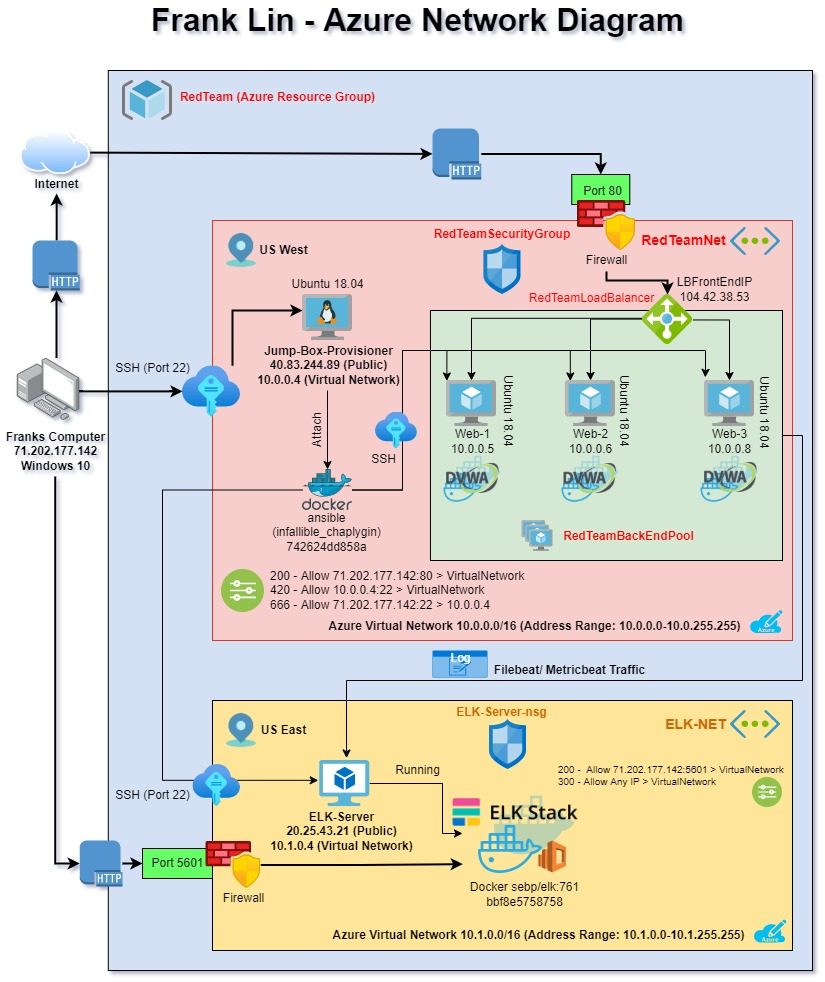

# Automated ELK Stack Deployment

The files in this repository were used to configure the network depicted below.

 "ELK Server Azure Network Diagram"

These files have been tested and used to generate a live ELK deployment on Azure. They can be used to either recreate the entire deployment pictured above. Alternatively, select portions of the "ELK Azure Network" file(s) may be used to install only certain pieces of it, such as Filebeat.

  - _[pentest.yml](Ansible/pentest.yml)_ - Configure Web Docker VM(s) with Ansible and Launch Web DVWA Docker Container
  - _[install-elk.yml](Ansible/install-elk.yml)_ - Configure E.L.K. Stack Server Docker VM with Ansible and increase Virtual Memory to "262144"
  - _[filebeat-config.yml](Ansible/filebeat-config.yml)_ - Full Filebeat Configuration file documenting all non-deprecated options in comments with IP Addresses updated for current use
  - _[filebeat-playbook.yml](Ansible/filebeat-playbook.yml)_ - Playbook to install and launch filebeat service
  - _[metricbeat-config.yml](Ansible/metricbeat-config.yml)_ - Metricbeat Configuration file highlighting only the most common options
  - _[metricbeat-playbook.yml](Ansible/metricbeat-playbook.yml)_ - Playbook to install metricbeat (Docker Metrics)

This document contains the following details:
- Description of the Topology
- Access Policies
- ELK Configuration
  - Beats in Use
  - Machines Being Monitored
- How to Use the Ansible Build


## Description of the Topology

The main purpose of this network is to expose a load-balanced and monitored instance of DVWA, the Damn Vulnerable Web Application.

Load balancing ensures that the application will be highly available, in addition to restricting access to the network.
- _"Load Balancing plays an important security role as computing moves evermore to the cloud. The off-loading function of a load balancer defends an organization against distributed denial-of-service (DDoS) attacks. It does this by shifting attack traffic from the corporate server to a public cloud provider."_

Integrating an ELK server allows users to easily monitor the vulnerable VMs for changes to the machine traffic/metrics and system logs.
- _"Filebeat monitors the log files or locations that you specify, collects log events, and forwards them either to Elasticsearch or Logstash for indexing."_
- _"Metricbeat is a lightweight shipper (or agent) which is used to collect system’s metrics and application metrics and send them to Elastic Stack Server (i.e Elasticsearch)"_

The configuration details of each machine may be found below:
<!--- _Note: Use the [Markdown Table Generator](http://www.tablesgenerator.com/markdown_tables) to add/remove values from the table_ -->

| **_Name_**           	| **_Function_** 	| **_IP Address_** 	| **_Operating System_** 	|
|----------------------	|----------------	|------------------	|------------------------	|
| Jump-Box-Provisioner 	| Gateway        	| 10.0.0.4         	| Ubuntu 18.04           	|
| Web-1                	| DVWA Container 	| 10.0.0.5         	| Ubuntu 18.04           	|
| Web-2                	| DVWA Container 	| 10.0.0.6         	| Ubuntu 18.04           	|
| Web-3                	| DVWA Container 	| 10.0.0.8         	| Ubuntu 18.04           	|

## Access Policies

The machines on the internal network are not exposed to the public Internet. 

Only the Jump-Box-Provisioner machine can accept connections from the Internet via the "LoadBalancerFrontEndIP" address. Access to this machine is only allowed from the following IP address with an authenticated SSH key:
> __71.202.177.143__

Machines within the network can only be accessed by the Jump-Box-Provisioner with its private IP address and authenticated SSH key:
> __10.0.0.4__

A summary of the access policies in place can be found in the table below.

| **_Name_**           	| **_Publicly Accessible_** 	| **_Allowed IP Addresses_**            	|
|----------------------	|---------------------------	|---------------------------------------	|
| Jump-Box-Provisioner 	| NO                        	| 71.202.177.142:80,  71.202.177.142:22 	|
| Web-1                	| NO                        	| 10.0.0.4                              	|
| Web-2                	| NO                        	| 10.0.0.4                              	|
| Web-3                	| NO                        	| 10.0.0.4                              	|
| ELK-Server           	| NO                        	| 10.0.0.4                              	|

## Elk Configuration

Ansible was used to automate the configuration of the ELK machine. No configuration was performed manually, which is advantageous for the following reasons:
- _Time savings translate to major reductions of costs before deployment and those associated with downtime_
- _Consistency and reliability due to automated accuracy; only the script needs to be checked and tested to execute correctly in real-world deployment_  
- _Putting Infrastructure as Code (IaC) to practice for more efficient operations_

The playbook implements the following tasks:
```
---
- name: Config Elk VM with Docker
  hosts: elk
  remote_user: RedAdmin
  become: true
  tasks:
```

- _Install docker.io using apt_
```
    - name: Install docker.io
      apt:
        update_cache: yes
        name: docker.io
        state: present
```

- _Install Python3-pip using apt_
```
    - name: Install Python3-pip3
      apt:
        force_apt_get: yes
        name: python3-pip
        state: present
```

- _Install Docker Python Module with pip_
```
    - name: Install Docker Python Module
      pip:
        name: docker
        state: present
```

- _Increase the Virtual Memory of the system to "262144" with systemctl_
```
    - name: Increase Virtual Memory to 262144
      sysctl:
        name: vm.max_map_count
        value: "262144"
        state: present
        reload: yes
```

- _Download and Launch a Docker ELK Container with the image "sebp/elk:761"_
```
    - name: Download and Launch a Docker Elk Container
      docker_container:
        name: elk
        image: sebp/elk:761
        state: started
        restart_policy: always
        published_ports:
          - 5601:5601
          - 9200:9200
          - 5044:5044
```

- _Enable Docker Service on Boot in systemd_
```
    - name: Enable Service Docker on Boot
      systemd:
        name: docker
        enabled: yes
```

The following screenshot displays the result of running `docker ps` after successfully configuring the ELK instance:


## Target Machines & Beats

This ELK server is configured to monitor the following machines:
- __10.0.0.5__
- __10.0.0.6__
- __10.0.0.8__

We have installed the following Beats on these machines:
- _Filebeat_
- _Metricbeat_

These Beats allow us to collect the following information from each machine:
- _System log files or locations that the user specifies translated as web traffic in addition to log events_
- _Metrics from your system(s) and service(s) such as CPU, memory, disk usages, network usages, and services such as Apache, MongoDB, Nginx, Redis, and Zookeeper_

## Using the Playbook

In order to use the playbook, you will need to have an Ansible control node already configured. Assuming you have such a control node provisioned: 

SSH into the control node and follow the steps below:
>- Copy the configuration file to Jump-Box-Provisioner's `/etc/ansible/files`.
>- Update the `hosts` file to include the IP addresses of the target machine(s) in the correct host's group (create if not already existing)
> 
>- Run the playbook, and navigate to the proper "_ELK Server Kibana_" GUI data installation page(s) in your web browser to check that the installation worked as expected:
> 
> 
  

## References  

A Guide to using Kibana and the GUI interface with sample data can be found in the following documentation:  
**[Guide to Exploring Kibana](Kibana/Exploring_Kibana.md)**

A write-up about using Containers for Cloud Security can be found in the following documention:  
**[Cloud Security: Containers](/Interview/Frank%20Lin%20-%20Project%201%20-%20Interview%20Questions.pdf)**

---
### Notes

- _All `YAML` files with the "-playbook" in the filename are the Ansible playbooks for the associated beat to install. All Ansible playbooks are located in the Docker Container `infallible_chaplygin` on the `Jump-Box-Provisioner` machine_ in the `/etc/ansible/roles` directory.
- _Be sure to update the `/etc/ansible/hosts` file with the proper IP Addresses of the target machines with the proper "host header" indicated by [ ]'s (square brackers) with the # comment removed. You would indicate in the playbooks to install the ELK Server and Filebeat/Metricbeat applications onto the "[elk]" listed machines indicated in the hosts file_
- _Navigate to the ELK Server IP at port `5601` to to check if the ELK server is running (`ELK.Server.Public.IPAddress:5601/app/kibana#/` or `http://20.25.43.21:5601/app/kibana#/`)_


---
## Command(s) References (BONUS)
<!--- _As a **Bonus**, provide the specific commands the user will need to run to download the playbook, update the files, etc._ -->

The following are commands/ instructions used to run and deploy each playbook. 

### SSH Key-Gen

After successful set up of the different VM components and settings for the network, including the Jump-Box-Provisioner and the applicable Web Servers, you want to set up security credentials that limit access between the machines to authenticated computers. With this we will generate a SSH Key pair with your local access machine to the Jump-Box-Provisioner as well as the Jump-Box-Provisioner to the Web Server(s), adding more authentication security while eliminating the need for passwords.

- Run in the command line: `ssh-keygen` to create a new SSH key pair.

Passphrase or password to the key is highly recommended as good general practice but not required.

- To SSH into the Jump-Box-Porvisioner after the public key from the generated key pair is uploaded using the following command `ssh admin-username@VM-public-IP` where "`admin-username`" is "`RedAdmin`" and "`VM-public-IP`" is "`40.83.244.89`" in this network set up (Command: `ssh RedAdmin@40.83.244.89`).

### Install Docker.io and Pull Ansible Contianer

- Install `docker.io` onto the Jump-Box-Provisioner by running `sudo apt update` to update current databases, then `sudo apt install docker.io`
- Check to see if Docker service is running with this command `sudo systemctl status docker`
- Once it is installed and running, pull the cyberxsecurity/ansible container with the command `sudo docker pull cyberxsecurity/ansible`
- Swith to the root user with `sudo su` and then run `docker run -ti cyberxsecurity/ansible:latest bash`to lauch the Ansible container and connect it. 

Run command will only be used once to start the container, and will not need to be run again. Running it again will generate another instance of a second docker container which is not needed. `docker rm [container_number]` can be used to remove unused containers.

### Start and Access Docker Container

- To list out the name(s) of the available Docker container(s) running, you will use the command `sudo docker container list -a` to list all containers.
- To start the container up, run `sudo docker start [name of container to start]` where the name of the container in this network is `infallible_chaplygin`
- Next, you will need to attach the container to access and use the container with command `sudo docker attach [name of container started]`
- Refer back to generating a new SSH key pair inside the container that will be used to authenticate access from the Docker container to the Web Server(s). We will use the Ansible container to access and set up the Web Severs to save time and for further layering our security.

### Running Playbooks from Ansible Container on Jump-Box-Provisioner

- YAML playbooks referenced previously in the README will be executed with the following command: `ansible-playbook [path and name of playbook]` as referenced by the examples:

`ansible-playbook /etc/ansible/pentest.yml`

`ansible-playbook /etc/ansible/install-elk.yml`

`ansible-playbook /etc/ansible/filebeat-playbook.yml`

`ansible-playbook /etc/ansible/metricbeat-playbook.yml`

These playbooks will set up different tasks as mentioned in the beginning of the README.


